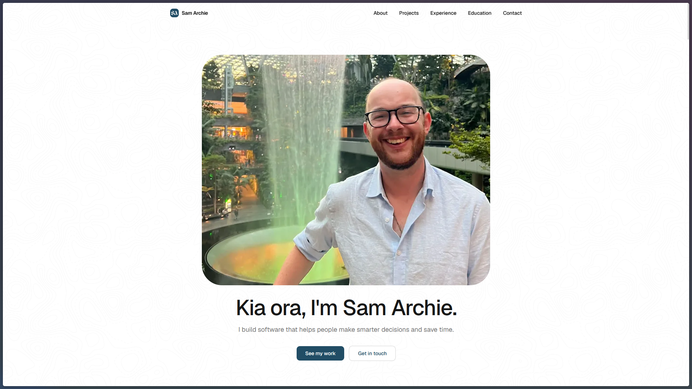

# My personal portfolio website

Built with React, Vite, and Tailwind, and shipped as a Cloudflare Worker with a Turnstile-protected contact form.

Deploys to [samarchie.dev](samarchie.dev) on every commit into `main`. Preview URLs are generated for every PR.



## Getting started

```bash
npm install
npm run dev
```

## Build

```bash
npm run build
```

## Deploy

```bash
npx wrangler deploy
```

The contact form needs two secrets set on the Worker before it'll send emails:

```bash
npx wrangler secret put TURNSTILE_SECRET_KEY
npx wrangler secret put STATICFORMS_API_KEY
```

## Lint

```bash
npm run lint
```
